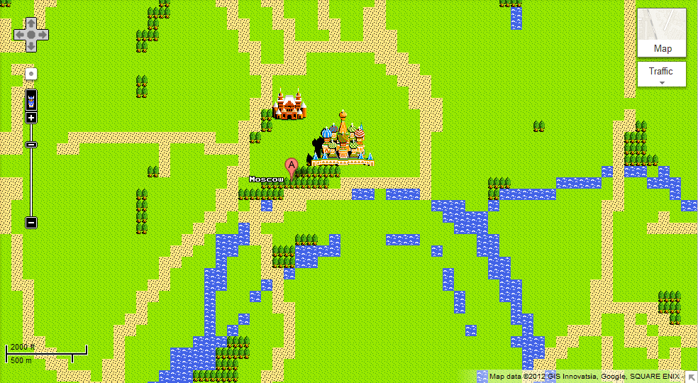

<!--  -->
<!-- _paginate: false -->
<!-- _class: lead -->
<!-- _header: '' -->

# **HOSVD Tensor Emulator for Spatiotemporal Emulators** 

### Evgeny Noi

*UC Santa Barbara, Department of Geography*

November 23, 2021


---

# Sources: 

**1. Pratola, M. T., & Chkrebtii, O. (2018). Bayesian calibration of multistate stochastic simulators. Statistica Sinica, 693-719.**
2. Gopalan, G., & Wikle, C. K. (2021). A Higher-Order Singular Value Decomposition Tensor Emulator for Spatiotemporal Simulators. Journal of Agricultural, Biological and Environmental Statistics, 1-24.

---
## Problem 
* Modeling spatiotemporal processes is **complicated** due to inherent complex ```dependencies``` across time, space and processes themselves (non-linearity, non-stationarity, non-separability). The process cannot be easily speicified as deterministic black-box. How do we add randomness and uncertainty to simulator for *ensemble realizations*?  

## Solution
* **Emulators** (surrogate statistical model to emulate input-output, which is computationally less expensive to evaluate)

<!-- * Approaches: 
    * physical-statistical models within hierarchical statistical framework (Berliner 2003; Kuhnert 2014)
    * black-box simulator (e.g. PDE and ABM) -->
    

---

<!-- _backgroundColor: white -->
<!-- _color: #DC267F -->
<!-- _class: lead -->

# Part 1: Emulators

---

# Emulators 

> Emulator is a function that mimics the output of a simulator at a fraction of simulator's cost. The function is most frequently specified by Gaussian Processes, polynomial basis expansions, and non-linear surrogate models. 

### Can we infer unknown calibration parameters from noisy indirect observation of system states at discrete spatial locations? 

<!-- * Projecting the output onto a standard basis representation (principal components) and adapting emulators to lower-dimensional projection of these fields.  -->

---

# Calibration Setting 

$$ y | \theta, \delta, \kappa, \Lambda_f \sim N (\kappa x(\theta) + \delta, \Lambda_f I)$$

We model a state $x(s; \theta)$ at spatiotemporal locations $s_i \in S$ and unknown calibration parameters $\theta \in \Theta$ from partial and indirect observations $y(s)$. $\delta(s)$ - additive systemic discrepency between the simulator and the true state, and $\kappa$ is a multiplicative discrepency. $\Lambda_f$ denotes $n \times n$ precision matrix denoting uncertainty. Likelihood is described by equation above, state is modeled as a realization of the Gaussian Process (GP), discrepancy is also modeled as GP.  

---

<!-- _backgroundColor: white -->
<!-- _color: #DC267F -->
<!-- _class: lead -->

# Part 2: Model Formulation

---

* $u$ - refers to $u$-th realization from multistate stochastic simulation 
* $k$ - refers to $k$-th state ouptut from multistate stochastic simulation 
* $i$ - denotes $i$-th output grid setting
* $j$ - refers to $j$-th setting of the calibration parameter vector 
* $n$ - number of locations, $p$ - number of variables, $n_S$ - number of states, $N$ - number of simulation realizations (calibrations) using MCMC, 
* the $u$-th realization of $x_k(s_i, \theta_j)$ for $u=1,..., N$. 
* tensorized representation: $\mathcal{X} \in R^{m \times n_s \times n \times N} = x_{u,k,i,j}$


<!-- # SVD Emulators

- Hidgon et al. (2008) 
    - SVD derived PCs of simulated runs and GP prior distribution on the weights 
- Hidgon et al. (2011) 
    - relax GP-based prior, model mean response via random-forests

```Simulator output can be approximately expressed as a linear combination of the UD columns from SVD``` -->

---

$$ [\mathcal{X}]_{u,k,i,j} = \sum_{r_1}^{R} \sum_{r_2}^{R} \sum_{r_3}^{R} \sum_{r_4}^{R} \mathcal{E}_{r_1, r_2, r_3, r_4} a_{u,r_1}^{(1)} a_{k,r_2}^{(2)} a_{i,r_3}^{(3)} a_{j,r_4}^{(4)}$$

where $R_1, R_2, R_3, R_4$ denote the rank of approximation, $\mathcal{E}$ is the $R_1 \times R_2 \times R_3 \times R_4$ core tensor (analogous to diagonal weight matrix in SVD), and $a_{u,r_1}^{(1)} \in A^{(1)}$, is an entry in $N \times R_1$ factor matrix $A^{(1)}$, the analogue of eigenvector in the SVD. The $\mathcal{X}$ is a tensor-variate Gaussian Process. Thus HOSVD decomposes tensor into: A) effects of variability across runs, B) variability across states; C) variability across spatio-temporal grid; D) variability across stochastic realizations of the simulator. 

---
# Putting it into a tensor 

Left singular vectors of $R_4$ can be seen as arising from latent eigenfunctions that describe the variability of the tensor across the $m$ simulator runs, motivating the use of a Gaussian process prior.  Thus we reconstruct a missing entry in our tensor representation of simulator outputs, the trajectory of the simulator at the unknown calibration parameter setting $\theta$, by modeling the appropriate eigenvectors. 

<!-- $$ C = U D V^T $$ 
where $C$ is an $M \times N$ matrix (output dims, runs).  
$$ c = U D v(\theta) + \epsilon $$
where $\epsilon$ is a mean-zero residual with non-diagonal covariance matrix $\Sigma$,  $v(\theta)$ specifies the $N$ coefficients of the linear combination for a particular value of $\theta$. 
$$ c = U D g(\theta, \beta) + \epsilon \quad \text{(non-linear regression)} $$
where $\beta$ are tuning parameters, and $\theta$ are inferential parameters.  -->

---

## Modeling Simulator Realizations

Let $X_{(4)}^{T} = UDV^T$ be the SVD of the transposed mode-4 matricization: $(N \cdot n \cdot n_s) \times m$, $U$ is the same shape as $X_{(4)}^{T}$ and $D$ and $V$ are both $m \times m$. To decrease the computational burden we utilize low-rank approximation using $n_c$ EOFs, such that $n_c < m$: 

$$ x_{ukij} \approx \sum_{l=1}^{n_c} v_l(\theta_j) U_{ukil} $$

where $v_l (\theta_j) = [V]_{jl}$ and the number of bases $n_c$ is determined via cross-validation. 

<!-- # Computational savings: 

1. use $r$ columns capturing most of the data variation from $UD$, 
2. train $r$ machine learning models for emulator
3. reduce computational time on function evaluation  -->

<!-- ---

* Emulate non-linear function $f(x, y, t, \theta_t, ... , \theta_p)$
* Emulations stored as multidimensional tensor $\mathcal{X}$ $M$ by $N$ by $T$ by $P_1$ ... by $P_p$
* latin hypercube is used for initial prior sampling 

Then for HOSVD we have: 

$$ f(x*, y*, t*, \theta*1,..., \theta*p) = Z \times u_1(x*) \times u_2(y*) \times u_3(t*) \times ... \times u_{p+3}(\theta*p) + \epsilon $$

where $u_1, ... , u_p$ - are non-linear vector-valued functions (behaving like $v(\theta)$ from SVD). 

--- 

# Emulator Construction

- Train supervised ML (e.g. GP regression) on $M$ values of $x$ and first column of $U_1$ to get $\hat{u}_{11}$. The choice of supervised ML method needs to be investigated.  -->

<!-- --- -->

<!-- ## Algorithm: 

1. Unfold and scale a tensor 
2. Run regular SVD. Compare screeplot with SVD of permuted unfolded matrices. Keep $\psi$ singular vectors.
3. For each tensor mode set truncated SVD rank at $\psi$ and adding 1 to account for scaling. 
4. Calculate decomposition quality - prop of var explained by R (R - low rank approx, $X_c = X - \bar{X}$)

$$ 1 - \frac{RSS}{TSS} =  1 - \frac{||X-R||_F^2}{||X_c||_F^2} $$ -->

---

<!-- _backgroundColor: white -->
<!-- _color: #DC267F -->
<!-- _class: lead -->

# Part 3: Application

---

### Application: stochastic water temperature model

The simulator requires ```nearby air temperature``` data to capture the **short-term fluctuations** of observed ```water temperatures```. The **annual trend** is separated from  the short term fluctuation by fitting a simple **sinusoid** to capture annual seasonal variation. 

$$ T_w(t) = T_a(t) + R_w(t) $$
$$ T_a(t) = a_1 + a_2 sin (\frac{2 \pi}{365}(t - t_0)) $$
$$ R_w(t) = K R_a(t) + \epsilon $$

---
<style>
img[alt~="center"] {
  display: block;
  margin: 0 auto;
}
</style>

### Application: stochastic water temperature model

Calibration parameters: $\theta = (a_1, a_2, t_0, K, \sigma)^T$ - overall temperature level, seasonal component scale, seasonal component offset, thermal diffusivity, short-term fluctuation deviation. 


---

### Application: stochastic water temperature model 

> The standard deviations of the posterior distributions for the predicted process are similar for both models, but the standard deviation for the discrepancy when accounting for simulator uncertainty (0.776) was about 10% smaller than when p

---

<!-- _backgroundColor: white -->
<!-- _color: #DC267F -->
<!-- _class: lead -->

# Part 4: Conclusion

---

# Conclusion 

* This presentation examplified the usage of tensorization and HOSVD for model calibration in PDE and AB models
* In both papers the authors describe procedure for identifying basis vectors via cross-validation/scree plots. However, the higher order orthogonal iteration (HOOI) can help calculate orthonormal basis of the dominant subspace. 

---
<!-- _class: lead -->
<!-- _header: '' -->
<!-- _paginate: false -->
<style scoped>
section {
  /* font-family: 'Times New Roman', serif !important; */
  font-size: 150%;
}
blockquote {
    text-align:left;
    border-left:3px;
    border-right:px;
    width:auto;
    display:inline-block;
    padding:1px px;
    font-size: 80%;
}
</style>



# Questions?
# :beers: 

*Evgeny Noi*  
 
> If geography is a prose, maps are iconography. (Lennar Meri)

:incoming_envelope: noi@ucsb.edu
